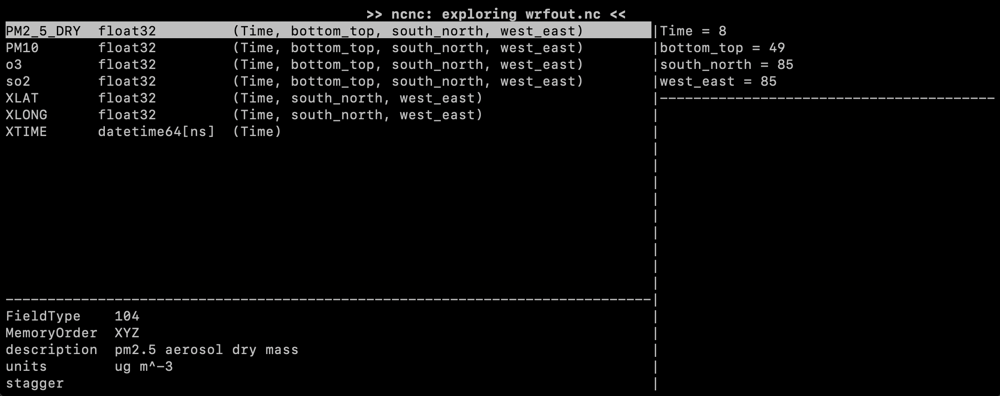
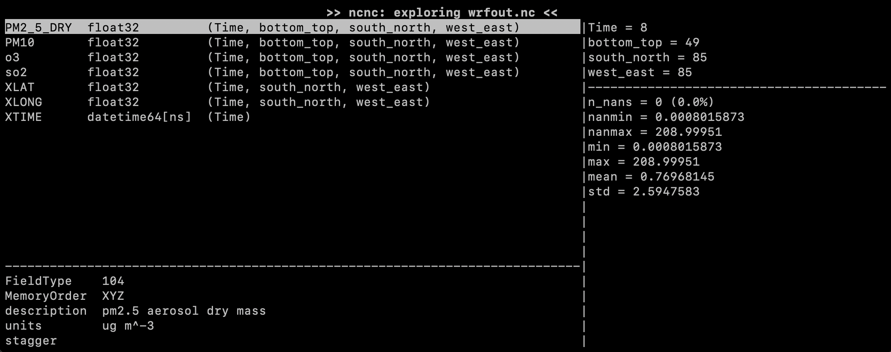

This content is released under the terms of the [Creative Commons Attribution Share Alike 4.0 International license](https://creativecommons.org/licenses/by-sa/4.0/).

# Part 1: Software licenses

Part 1 of this lab is a short [multiple-choice questionnaire on software licenses ([questionnaire-on-licenses.md](./questionnaire-on-licenses.md)). Select the correct answer(s) by adding a lower-case x in the corresponding boxes. Push the update file to Github/Gitlab to check your answers.

# Part 2: Introduction to code modularity

This part is intended to demonstrate that, when a program is built in a modular way, it is possible to modify and improve it without having to understand or even read the entire code.

For this, we provide a home-made terminal-based viewer for NetCDF files ([ncnc.py](./ncnc.py)). This programme is missing a functionality, and you will have to add it yourself.

First, try to launch `ncnc` to see what it looks like:

```sh
python ncnc.py $a_netcdf_file_of_your_choice.nc
```

> [!NOTE]
> You need to be in an environment where xarray is available.

When launched, `ncnc` will look something like:



The top-left area shows the list of variables defined in the NetCDF file. The top-right area shows the dimensions defined in the file. The bottom-left area shows the attributes of the variable that is currently selected. All these NetCDF concepts should be familiar to you since lab 2. We will talk about the bottom-right area later on.

You can navigate within `ncnc` using the following keys:

| key               | action                                       |
|-------------------|----------------------------------------------|
| arrow down or "n" | select next variable or global attribute     |
| arrow up or "p"   | select previous variable or global attribute |
| "G"               | select last variable                         |
| "g"               | select first variable                        |
| "a"               | show global attributes ("q" to return)       |
| "q"               | quit                                         |

> [!CAUTION]
> The `ncnc` program is coded in a minimal way. It will crash if you resize the window while it is running. Besides, it does not support NetCDF files with groups.

You job is to implement a function that calculates statistics on the selected variable when the "s" key is pressed. This should yield something like:



That's it! Open `ncnc.py` and see what you can do. You do not have to understand the entirety of the code to achieve the required task (that is the point of this exercice). Find what you need to change and write a few lines of code to add the desired feature. We only ask for the statistics shown in the example above. You can add more as you see fit. Push your modified `ncnc.py` file to Github/Gitlab to test your code.

> [!NOTE]
> The binding to the "s" key is already implemented. You really only have to calculate the statistics.
